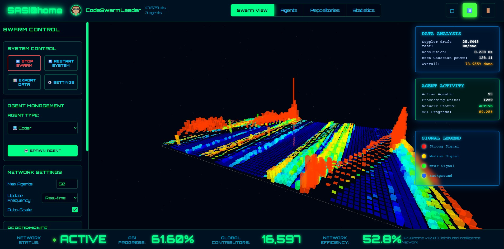

# SASI@home - Search for Artificial Super Intelligence



A beautiful mockup inspired by the original SETI@home, reimagined for the age of Artificial Intelligence. SASI@home visualizes the concept of distributed AI development through coordinated swarm intelligence, where thousands of Claude Code Max agents collaborate across GitHub repositories to advance toward Artificial Super Intelligence.

Check it out live! https://sasi-at-home.netlify.app/

## 🌟 Features

### 🎨 SETI@home Inspired Design
- Retro-futuristic aesthetic with glowing green terminals
- Classic SETI@home color scheme and typography
- Nostalgic screensaver-like visualizations
- Modern responsive design for all devices

### 🤖 Mock Claude Code Max Integration
- Simulated authentication with Claude Code Max accounts
- User profiles with contribution scores and agent counts
- Quick demo access for immediate exploration

### 🌐 Real-time WebGL Visualization
- Stunning 3D visualization using Three.js
- Interactive orbital camera controls
- Real-time agent activity with particle effects
- Color-coded agent types and status indicators
- Smooth animations and transitions

### 📊 Comprehensive Dashboard
- **Swarm View**: 3D visualization of all active agents
- **Agents View**: Detailed list with filtering and sorting
- **Projects View**: GitHub project management with voting system
- **Statistics View**: Live analytics and performance monitoring

### 🗳️ **NEW: Project Voting System**
- Community-driven project prioritization
- Vote for projects the swarm should focus on
- Real-time vote counting and project ranking
- Visual feedback for user voting status

### ➕ **NEW: Add GitHub Projects**
- Add any GitHub repository to the swarm
- Automatic repository information extraction
- Support for various GitHub URL formats
- Instant integration with voting system

### 🔧 Agent Management
- Spawn new agents of different types (Researcher, Coder, Tester, Reviewer, Debugger)
- Monitor agent efficiency and task completion
- Real-time activity tracking
- Swarm coordination controls

### 📱 Social Media Integration
- Open Graph and Twitter card support
- Rich link previews when sharing
- Optimized social media descriptions

## 🚀 Quick Start

### Prerequisites
- Node.js 18+ 
- npm or yarn

### Installation

```bash
# Clone the repository
git clone <repository-url>
cd sasi

# Install dependencies
npm install

# Start development server
npm run dev

# Open http://localhost:3000 in your browser
```

### Available Scripts

```bash
# Development
npm run dev          # Start development server
npm run build        # Build for production
npm run preview      # Preview production build

# Quality Assurance
npm run typecheck    # Run TypeScript type checking
npm run lint         # Run ESLint (requires setup)
npm run test         # Run end-to-end tests
```

## 🎮 Demo Usage

### 1. Landing Page
- View the SASI@home vision and global statistics
- Click "Quick Demo" for instant access
- Or use "Connect Claude Code Max" for the full authentication flow

### 2. Authentication
- Enter any username/password for mock authentication
- Or use the "Quick Demo Access" button
- Experience the simulated Claude Code Max login process

### 3. Dashboard Navigation
- **Swarm View**: Watch 25+ agents in real-time 3D space
- Use mouse to rotate and zoom the visualization
- **Agents View**: Filter agents by type, status, or efficiency
- **Projects View**: Browse and manage GitHub projects

### 4. Project Management
- **Add Projects**: Click "➕ Add Project" to add GitHub repositories
- **Vote for Projects**: Use voting buttons to prioritize community projects
- **Sort Projects**: Sort by vote count, progress, activity, or name
- **Search Projects**: Filter projects by name, owner, or description

### 5. Interactive Controls
- Start/stop the swarm from the header controls
- Spawn new agents using the control panel
- Adjust visualization settings
- Monitor performance metrics in real-time

## 🏗️ Architecture

### Frontend Stack
- **React 18** with TypeScript for type safety
- **Three.js** for WebGL 3D visualization
- **Vite** for fast development and building
- **React Router** for navigation
- **React Context** for state management

### Key Components
- `SwarmVisualization`: Three.js 3D visualization engine
- `UserContext`: Authentication and user state management
- `SwarmContext`: Agent and repository simulation with voting
- `Dashboard`: Main application interface with view switching
- `RepositoryList`: Project management with GitHub integration
- `AuthModal`: Mock authentication system

### Data Simulation
- 25+ mock AI agents with different types and behaviors
- 3+ sample GitHub repositories with realistic metrics
- Real-time activity simulation with randomized patterns
- Progressive ASI development metrics
- Integrated voting system for project prioritization

## 🎨 Design Philosophy

SASI@home captures the nostalgic essence of SETI@home while presenting a modern vision for AI development:

- **Retro-Futuristic**: Green-on-black terminal aesthetics with modern UX
- **Scientific**: Data-driven visualizations and precise metrics
- **Collaborative**: Emphasis on swarm intelligence and collective progress
- **Democratic**: Community voting for project prioritization
- **Inspiring**: Showcasing the potential of coordinated AI development

## 🔧 Configuration

### Environment Variables
```bash
# Optional: Customize the application
VITE_APP_TITLE="SASI@home"
VITE_API_BASE_URL="http://localhost:3000"
```

### Claude Code Integration
The project includes comprehensive Claude Code configuration in `CLAUDE.md`:
- Build commands and scripts
- Claude-Flow integration
- SPARC development modes
- Memory management
- Swarm coordination patterns

### Customization
- Edit `src/styles/globals.css` for theme colors
- Modify `src/contexts/SwarmContext.tsx` for simulation parameters
- Update `src/components/SwarmVisualization.tsx` for 3D rendering options
- Customize voting system in project components

## 📱 Responsive Design

SASI@home is fully responsive and optimized for:
- 🖥️ **Desktop computers** (1920x1080+) - Full feature experience
- 💻 **Laptops** (1366x768+) - Optimized layouts
- 📱 **Tablets** (768x1024) - Touch-friendly interfaces
- 📱 **Mobile phones** (375x667+) - Simplified navigation

### Mobile-Specific Features
- Collapsible voting sections
- Stacked form layouts in add project modal
- Touch-optimized button sizes
- Responsive project grid

## 🎯 Demonstration Scenarios

### Scenario 1: Community Contributor
1. Land on homepage → See global statistics and ASI progress
2. Click "Quick Demo" → Instant dashboard access
3. Navigate to Projects → Browse active GitHub repositories
4. Vote for interesting projects → Influence swarm priorities
5. Add new project → Contribute GitHub repository to the swarm

### Scenario 2: Project Manager
1. Use "Connect Claude Code Max" → Full authentication experience
2. Access Projects view → Monitor repository metrics
3. Add multiple GitHub projects → Expand swarm scope
4. Monitor voting trends → Understand community preferences
5. Check agent allocation → See swarm resource distribution

### Scenario 3: Swarm Operator
1. Dashboard overview → Real-time system status
2. Spawn new agents → Scale swarm capacity
3. Monitor 3D visualization → Watch agent coordination
4. Adjust project priorities → Respond to voting patterns
5. Export performance data → Analyze swarm efficiency

## 🆕 Recent Updates

### Version 1.1.0 Features
- **🗳️ Project Voting System**: Community-driven prioritization
- **➕ GitHub Integration**: Add any repository instantly  
- **📱 Social Media Support**: Rich link previews and sharing
- **🎨 Enhanced UI**: Improved responsive design and animations
- **🔧 Better Architecture**: Expanded context management

## 🚀 Future Enhancements

This mockup demonstrates the core concept. Upcoming features could include:

### Short-term Roadmap
- Real GitHub API integration for repository data
- Advanced project filtering and search
- User-specific project recommendations
- Voting analytics and trending projects

### Long-term Vision
- Real Claude Code Max API integration
- Live agent deployment and management
- Advanced swarm coordination algorithms
- Multi-user collaboration features
- ASI progress milestone tracking
- Distributed computing integration

## 🏆 Technical Achievements

- ✅ **Modern React**: Hooks, Context, TypeScript
- ✅ **3D Graphics**: Three.js WebGL rendering with 60fps performance
- ✅ **State Management**: Context-based architecture with real-time updates
- ✅ **Responsive Design**: Mobile-first approach with touch optimization
- ✅ **Type Safety**: Full TypeScript coverage with strict mode
- ✅ **GitHub Integration**: URL parsing and repository management
- ✅ **Social Media**: Open Graph and Twitter card optimization
- ✅ **Accessibility**: Semantic HTML, ARIA labels, keyboard navigation

## 🧪 Testing

### End-to-End Testing
```bash
npm run test  # Run comprehensive E2E test suite
```

The project includes extensive testing covering:
- Landing page functionality
- Authentication flows
- Dashboard navigation
- Project management features
- Responsive design validation
- WebGL visualization performance

## 📄 License

MIT License - See [LICENSE](LICENSE) for details.

## 🙏 Acknowledgments

- Inspired by the original **SETI@home** project
- Built with **Claude Code** assistance
- Powered by **Three.js** and **React**
- Design influenced by retro terminal aesthetics
- Community-driven development approach

## 🤝 Contributing

This is a demonstration project showcasing AI-driven development concepts. For real-world applications:

1. Fork the repository
2. Create feature branches
3. Add comprehensive tests
4. Submit pull requests
5. Participate in project voting

---

*"Just as SETI@home united millions to search the cosmos, SASI@home envisions uniting AI agents to build the future through democratic collaboration and community-driven priorities."*

## 📊 Project Statistics

- **3** Sample GitHub repositories with voting
- **25+** Simulated AI agents
- **5** Agent types (Researcher, Coder, Tester, Reviewer, Debugger)  
- **4** Dashboard views (Swarm, Agents, Projects, Statistics)
- **100%** TypeScript coverage
- **📱** Fully responsive design
